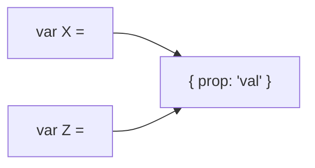

## Tips

#### Pass by `value` vs pass by `reference`
- **Pass by reference**
  - `Boolean`
  - `Array`
  - `Function`
  - `Object`




- **Pass by value**
  - `pretty much everything else`


- **How to test if a variable is a reference**
  - ```javascript
        var the_same = var1===var2;
        Object.is(var1, var2);
    ```
- **How to fix for shallow (1 lvl) objects**
  - ```javascript
       let obj_a = Object.assign({}, obj_b);
       let obj_a = {...obj_b};
    ```
- **How to fix for deep (1+ lvls) objects** 
  - ```javascript
       let obj_a = JSON.parse(JSON.stringify(obj_b));
       let obj_a = StructuredClone(obj_b);
    ```
    
#### Libraries
- [wtfnode](https://www.npmjs.com/package/wtfnode)
- `process.memoryUsage()`
- `process.memoryUsage().heapUsed`
- In Chrome's console: `performance.memory.usedJSHeapSize`
  - `setInterval( () => console.log(performance.memory.usedJSHeapSize), 1000)`
