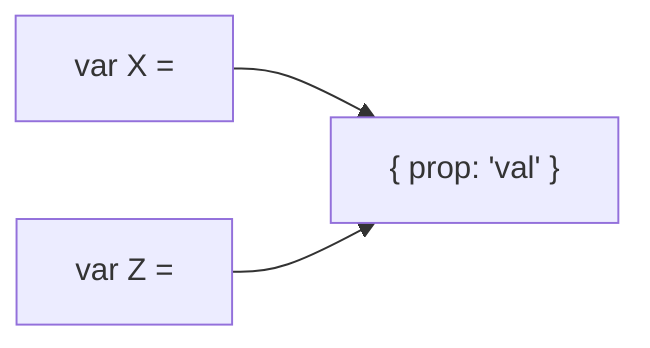

## Tips

#### Pass by `value` vs pass by `reference`
- **Pass by reference**
  - `Boolean`
  - `Array`
  - `Function`
  - `Object`

- **Pass by value**
  - `pretty much everything else`



- **How to test if a variable is a reference**
  - ```javascript
        var the_same = var1===var2;
        Object.is(var1, var2);
    ```


#### Libraries
- [wtfnode](https://www.npmjs.com/package/wtfnode)
